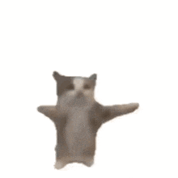

# Racing Game -- CS241 Final Project
### Matteo Herron & Sylvie Schenck

## Proposal

We will be making a top-down local multiplayer versus racing game, where one player uses WASD and one uses the arrow keys. The aim of the game is to finish three laps around the track, however, the cars have bumper-cars-esque physics and will bounce off of each other on collision. There will also be multiple power-ups that the players can use to gain an advantage or wreak havoc on their opponent. We may take inspiration from Mario Kart with the powerups, such as items that resemble the mushroom boost and banana peel. The track will also have obstacles such as sharp turns and ice patches that decrease the friction. To implement our game, we will be using the Macroquad library for Rust. This library supports in-game audio, key detection, and in-game collision detection/physics. The Macroquad manual can be found [here](https://macroquad.rs/docs/).

We have already created the basic structure of a game with a game loop, and even learned how to read keyboard inputs and play sounds. We need to learn how to use our own images, so that the game isn’t just basic shapes and colors. We also need to learn how to make the cars turn like actual cars, with a turning radius instead of sharp movement. The most difficult part of this project will most likely be collision mechanics between cars - how is each car affected, and how can we program those changes? We will have to get creative, and Macroquad might not have the capabilities to program game physics - in this scenario, Bevy and Fyrox libraries are good albeit more challenging alternatives. Finally, although we have some experience with coding games in other languages, we will have to learn how to use the Macroquad library in Rust in order to implement game mechanics.

For our schedule, we’re aiming to have two basic cars that can be controlled with WASD and arrow keys as well as some basic physics for friction by November 1st. By the status update on November 15th, we should have the turning mechanic done, a basic outline of the track, collision physics with the track walls, and collision between cars. By November 22nd, we’re shooting for the countdown before the race starts, a win screen when one player completes the race, and at least some obstacles and power-ups. By December 13th, we’ll have finished the core mechanics of our game, and have moved on to testing as well as writing up our presentation. At this time, we’ll also look into the validity of our stretch goals and see if anything is attainable/implementable, leaving us with plenty of time to prepare for our in-class presentation. If we reach all of the goals with time to spare, our stretch goals include some kind of drifting mechanic, better graphics, more power-ups, and a better thought-out map. One idea we both had as a super-stretch-goal is online play, or some ability to have multiple people/cars drive at once. If this is unreasonable, we could potentially implement computer-played cars, giving players the illusion that they are playing with multiple people. However, this seems like a lot more work, and might be better suited for a Winter Term project.

## Status Update

To re-summarize our project, we are making a top-down local multiplayer-versus racing game with bumper-cars-esque physics. So far, we have two cars that can be driven using WASD and the arrow keys. We spent a lot of time perfecting the movement, which was surprisingly complicated. First we had the cars move in the direction of the key being pressed, but that obviously isn’t how real cars drive. We then changed the movement such that the left and right keys changed the cars’ direction, and the up and down keys moved it forward and backward. After adding some momentum and friction physics, we realized that we made the movement almost perfect for drifting, but we want the cars to have traction with the ground when not drifting. We also wanted to replicate the motion of real cars by preventing you from turning without actually moving at all, which we were able to implement. At this point, we’re very happy with the movement and are ready to focus on collision mechanics.

For our old schedule, we had wanted to have two basic cars that can be controlled with WASD and arrow keys as well as some basic physics for friction by November 1st. By the status update on November 15th, we wanted to have the turning mechanic done, a basic outline of the track, collision physics with the track walls, and collision between cars. We finished our November 1st goal with flying colors, however after that we lost a little bit of steam. Sylvie got sick, Matteo got very overwhelmed with the new movement system (sine and cosine are hard), and this combined with our classes picking up in difficulty and seasonal depression resulted in our development slowing greatly. We believe that we achieved most of our goals - friction, movement, turning, and a basic outline of collision. However, we did not end up achieving our goal for implementing collision. While we know how to detect when two objects are colliding, we need to implement the physics resulting from the collision. We want our cars to have bouncy bumper-car properties, where both cars are bounced in the opposite direction of collision by a factor of their speed. In this case, the opposite direction of collision refers to car 1 taking on the movement direction of car 2, while car 2 takes on the movement direction of car 1. There is also a minimum bounce distance for cars with the same speed and opposite direction. We also have not developed collision for the track yet, and we just have a .png background so far. One plan is to have an invisible circle around the car that acts as a collision detector, so when an object is within the radius of the car’s circle, collision physics activates.

For our revised schedule, we’re going to push back the collision until November 29th, and then shoot for the countdown, win screen, and obstacles by December 13th. This should allow us time to work on our presentation and write-up before the final project deadline.

